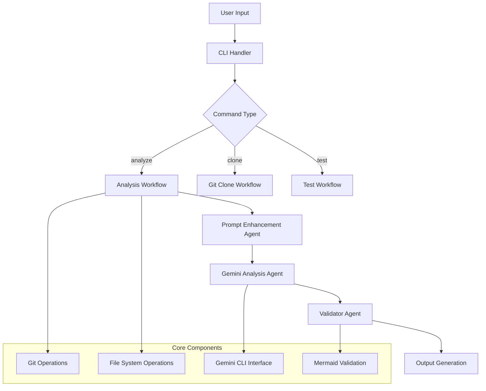

# Diagram Generator

A powerful AI-driven codebase analysis tool that generates comprehensive architectural documentation with Mermaid diagrams using Google's Gemini AI.

## 🌟 Features

- 🤖 **AI-Powered Analysis**: Leverages Google Gemini 2.5 Pro for intelligent code understanding
- 📊 **Mermaid Diagrams**: Generates validated flowcharts, sequence diagrams, class diagrams, and more
- 🔗 **Git Integration**: Clone and analyze repositories directly from URLs
- 🎯 **Smart Prompts**: AI-enhanced prompts that adapt to your specific domain and architecture
- ✅ **Validation Agent**: Built-in Mermaid syntax validation and correction
- 🔄 **Iterative Refinement**: Follow-up improvements and documentation enhancement
- 📝 **Professional Output**: Clean, documentation-ready markdown for engineering teams

## 🏗️ Architecture

The Diagram Generator follows a multi-agent architecture:



### Core Components

1. **CLI Handler** (`src/cli.js`): Main entry point handling commands and user interaction
2. **Prompt Enhancement Agent**: Analyzes user requests and creates domain-specific prompts
3. **Gemini Analysis Agent**: Performs AI-powered codebase analysis
4. **Validator Agent**: Validates and corrects Mermaid diagram syntax
5. **Git Operations**: Handles repository cloning and cleanup
6. **File System Operations**: Manages file I/O and directory operations

## 🚀 Quick Start

### Option 1: Docker (Recommended)

1. **Prerequisites**: Docker and Docker Compose
2. **Setup:**
   ```bash
   # Copy environment template
   cp .env.example .env

   # Edit .env and add your Gemini API key
   nano .env

   # Build and start container
   docker-compose up -d

   # Get shell access
   docker-compose exec diagram-generator bash
   ```

3. **Usage in container:**
   ```bash
   # Analyze current directory (output automatically goes to ./output/ on host)
   node src/cli.js analyze .

   # Analyze a git repository
   node src/cli.js analyze https://github.com/user/repo.git

   # Analyze a specific branch
   node src/cli.js analyze https://github.com/user/repo.git -b develop

   # Results are automatically saved to ./output/ on your host machine
   ```

### Option 2: Local Installation

1. **Prerequisites**: Node.js (v22+), Git, Gemini CLI
2. **Install dependencies:**
   ```bash
   npm install
   ./setup.sh
   export GEMINI_API_KEY="your-api-key-here"
   ```

### First Analysis

```bash
# Test the setup
npm run test

# Analyze current directory
npm run analyze

# Analyze with custom prompt
node src/cli.js analyze --prompt "Create a system architecture diagram"
```

## 📖 Usage Guide

### Command Structure

```bash
analyzer <command> [options]
```

### Available Commands

#### `analyze` - Analyze codebases and generate diagrams

```bash
# Basic usage
analyzer analyze [path] [options]

# Examples
analyzer analyze                                    # Current directory
analyzer analyze ./src                              # Specific directory
analyzer analyze https://github.com/user/repo.git  # Git repository
```

**Options:**
- `-p, --prompt <prompt>`: Custom analysis prompt
- `-o, --output <file>`: Output file path (default: analysis-output.md)
- `-b, --branch <branch>`: Git branch to clone (for repository URLs)
- `--api-key <key>`: Gemini API key (overrides environment)
- `--model <model>`: Gemini model to use (default: gemini-2.5-pro)
- `--clone-dir <dir>`: Directory for cloned repos (default: ./temp-repos)
- `--keep-clone`: Keep cloned repository after analysis
- `--verbose`: Enable detailed logging

#### `clone` - Clone repositories for analysis

```bash
analyzer clone <repo-url> [options]

# Examples
analyzer clone https://github.com/user/repo.git
analyzer clone https://github.com/user/repo.git -b develop
```

**Options:**
- `-d, --dir <directory>`: Clone directory (default: ./temp-repos)
- `-b, --branch <branch>`: Specific branch to clone
- `--keep`: Keep the cloned repository

#### `test` - Test Gemini CLI connection

```bash
analyzer test [options]

# Examples
analyzer test
analyzer test --api-key "your-key-here"
```
## 🎯 Example Use Cases

### System Architecture Analysis
```bash
analyzer analyze --prompt "Create a comprehensive system architecture diagram showing all components, their relationships, and data flows"
```

### Branch-Specific Analysis
```bash
# Analyze the main branch
analyzer analyze https://github.com/user/repo.git

# Analyze development branch with custom prompt
analyzer analyze https://github.com/user/repo.git -b develop --prompt "Focus on recent changes and new features"
```

### Payment Flow Documentation
```bash
analyzer analyze --prompt "Analyze payment processing flows and generate a sequence diagram showing the complete payment lifecycle from initiation to completion"
```

### Database Schema Visualization
```bash
analyzer analyze --prompt "Generate an entity-relationship diagram from database models, including relationships and key constraints"
```

### API Documentation
```bash
analyzer analyze --prompt "Create sequence diagrams showing API request/response flows, including authentication and error handling"
```

### Microservices Architecture
```bash
analyzer analyze --prompt "Document microservices architecture with service boundaries, communication patterns, and dependencies"
```

## 🔧 Advanced Features

### AI-Enhanced Prompts

The tool automatically enhances your prompts with domain-specific details:

1. **Domain Detection**: Identifies the type of system (payment, auth, API, etc.)
2. **Component Mapping**: Adds relevant architectural components
3. **Pattern Recognition**: Includes common patterns for the domain
4. **Technical Details**: Adds framework-specific considerations

### Validation Agent

Every generated diagram goes through validation:

- **Syntax Checking**: Validates Mermaid diagram syntax
- **Error Correction**: Automatically fixes common issues
- **Re-validation**: Ensures corrections are successful
- **Quality Assurance**: Produces documentation-ready output

### Iterative Refinement

After initial analysis, you can:

1. **Add Details**: Request additional information or diagrams
2. **Refine Focus**: Narrow down to specific components
3. **Change Perspective**: Switch diagram types or viewpoints
4. **Enhance Documentation**: Add explanations or context

## 📁 Project Structure

```
diagram-generator/
├── src/
│   ├── cli.js          # Main CLI application
│   └── index.js        # Module exports
├── example-prompts.md  # Example prompts for different use cases
├── USAGE.md           # Detailed usage guide
├── package.json       # Project configuration
├── setup.sh          # Setup script
└── README.md         # This file
```

## � Docker Usage

The Docker setup provides a clean, isolated environment with all dependencies pre-installed.

### Basic Commands

```bash
# Start container
docker-compose up -d

# Access container shell
docker-compose exec diagram-generator bash

# Run analysis inside container
docker-compose exec diagram-generator node src/cli.js analyze https://github.com/user/repo.git

# View output (saved to ./output/ on host)
ls output/

# Stop container
docker-compose down
```

### File Access

- **Output**: Results are automatically saved to `./output/` on your host machine
- **Git cloning**: The application clones repositories directly inside the container
- **Persistent storage**: Analysis results persist on your host machine

## �🛠️ Configuration

### Environment Variables

- `GEMINI_API_KEY`: Your Google Gemini API key (required)

### Command-Line Options

Global options available for all commands:
- `--verbose`: Enable detailed logging and real-time output
- `--api-key`: Override environment API key
- `--model`: Specify Gemini model (default: gemini-2.5-pro)

### Output Customization

- **File Format**: Always generates markdown with embedded Mermaid diagrams
- **Diagram Types**: Supports flowcharts, sequence diagrams, class diagrams, ER diagrams, and more
- **Validation**: All diagrams are syntax-validated before output

## 🔍 Troubleshooting

### Common Issues

1. **API Key Not Found**
   ```bash
   export GEMINI_API_KEY="your-api-key-here"
   ```

2. **Gemini CLI Not Installed**
   ```bash
   npm install -g @google/gemini-cli
   ```

3. **Git Clone Failures**
   - Check repository URL and permissions
   - Ensure Git is installed and configured

4. **Analysis Timeouts**
   - Use `--verbose` flag to monitor progress
   - Try analyzing smaller directories first

### Debug Mode

Enable verbose logging for detailed information:
```bash
analyzer analyze --verbose
```

## 📚 Documentation

- **USAGE.md**: Comprehensive usage guide with examples
- **example-prompts.md**: Collection of proven prompts for different scenarios

## 🤝 Contributing

1. Fork the repository
2. Create a feature branch (`git checkout -b feature/amazing-feature`)
3. Commit your changes (`git commit -m 'Add amazing feature'`)
4. Push to the branch (`git push origin feature/amazing-feature`)
5. Open a Pull Request

## 📄 License

This project is licensed under the MIT License - see the [LICENSE](LICENSE) file for details.

## 🙏 Acknowledgments

- Google Gemini AI for powerful code analysis capabilities
- Mermaid.js for excellent diagram rendering
- The open-source community for inspiration and tools

## 📞 Support

- **Issues**: [GitHub Issues](https://github.com/your-username/diagram-generator/issues)
- **Documentation**: Check USAGE.md and example-prompts.md
- **Community**: Share your generated diagrams and use cases!
