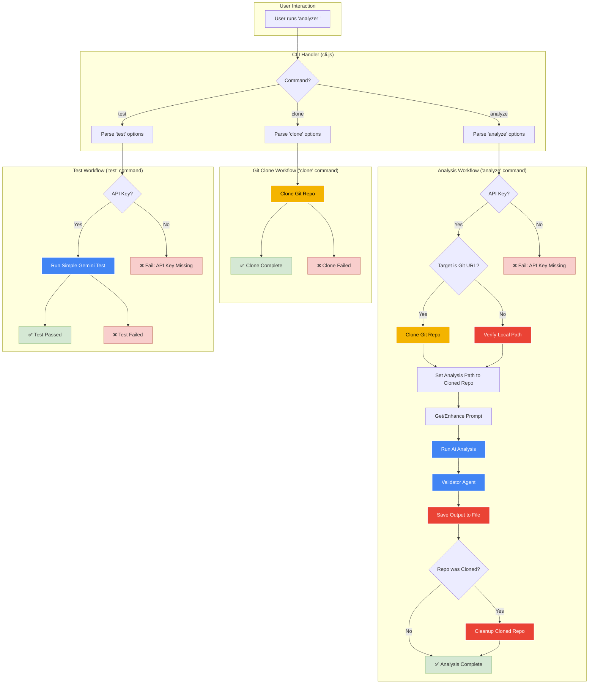

Of course. I have analyzed the provided Mermaid diagram, identified several syntax and structural issues that would prevent it from rendering correctly, and have fixed them.

The primary issues were the improper use of `subgraph` for "Core Logic" and "Legend," which broke the diagram's flow and contained invalid syntax. I have refactored the diagram to integrate the styling and concepts from these blocks directly into the main flowchart using `classDef` for better readability and correctness.

Here is the validated and corrected markdown:

***

Based on the content of `src/cli.js` and `src/index.js`, here is a Mermaid flowchart that illustrates the main components and workflow of the diagram-generator project.

This diagram uses color to distinguish different types of operations:
- **Blue nodes** represent interactions with the Gemini API.
- **Yellow nodes** represent Git operations.
- **Red nodes** represent file system operations.

