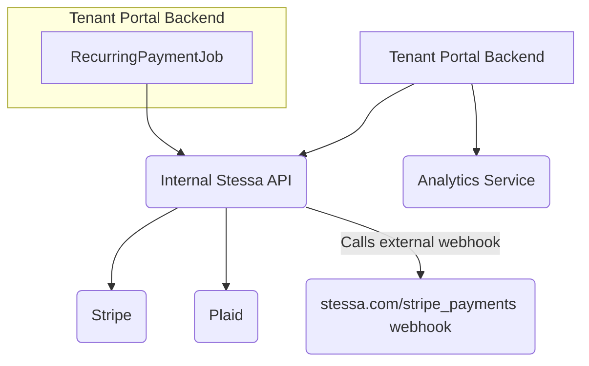
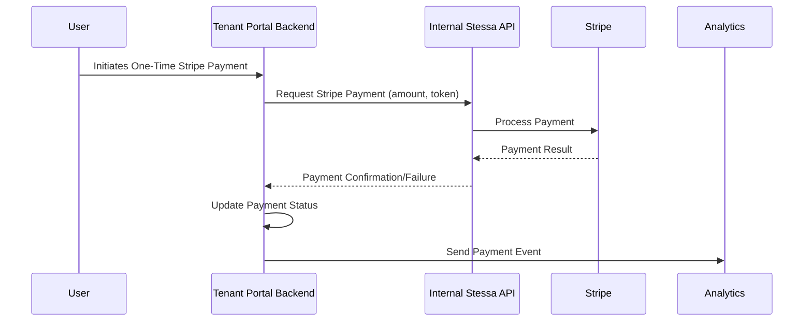
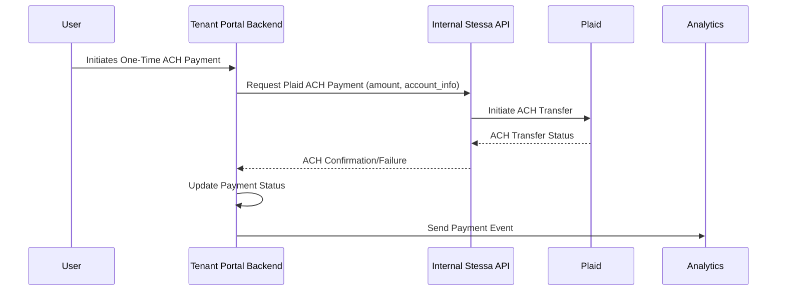
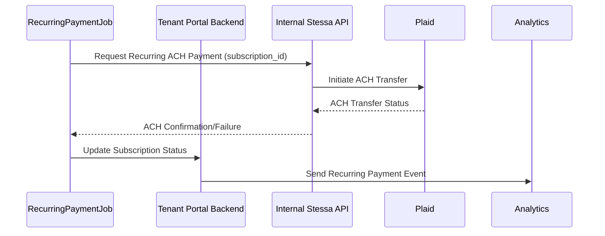

# Architectural Overview: Stripe and Payment Processing

This document outlines the payment processing architecture within the Tenant Portal Backend, focusing on one-time and recurring payment flows. The system primarily interacts with an internal Stessa API, which then mediates interactions with external payment gateways like Stripe and Plaid.

## Key Components

*   **Tenant Portal Backend (TPB)**: The application responsible for user-facing payment initiation and status updates.
*   **Internal Stessa API (ISA)**: An internal service that abstracts direct interactions with payment gateways.
*   **Stripe**: External payment gateway for credit card processing.
*   **Plaid**: External service for ACH (Automated Clearing House) bank transfers.
*   **Analytics Service**: Collects and processes payment-related events.
*   **RecurringPaymentJob**: A background job within the Tenant Portal Backend that handles scheduled recurring payments.
*   **stessa.com/stripe_payments webhook**: An external webhook endpoint called by the Internal Stessa API for Stripe-related events.

## System Overview

## One-Time Payment Flow (Stripe)

This sequence diagram illustrates the process for a user initiating a one-time payment via Stripe.

## One-Time Payment Flow (ACH via Plaid)

This sequence diagram details the flow for a user making a one-time ACH payment through Plaid.

## Recurring Payment Flow (ACH via Plaid)

This diagram shows how recurring ACH payments are processed, initiated by the `RecurringPaymentJob`.

## Note on Webhook Handling

It's important to note that the Tenant Portal Backend does not directly expose or handle Stripe webhooks. Asynchronous updates from Stripe are likely managed by the Internal Stessa API, which also makes outbound calls to an external `stessa.com/stripe_payments` webhook.