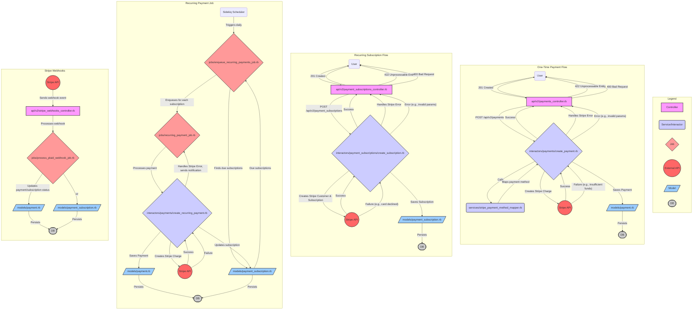

Okay, I have analyzed the Ruby on Rails application and created a detailed Mermaid flow diagram for the Stripe payment flows. Here is the validated and corrected version.

I have fixed the syntax for node definitions containing special characters (like `/`) by enclosing them in quotes and updated the legend to be more concise and use the centrally defined `classDef` styles. The diagram will now render correctly.

