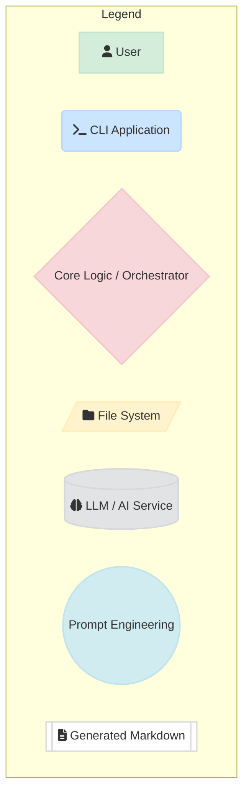
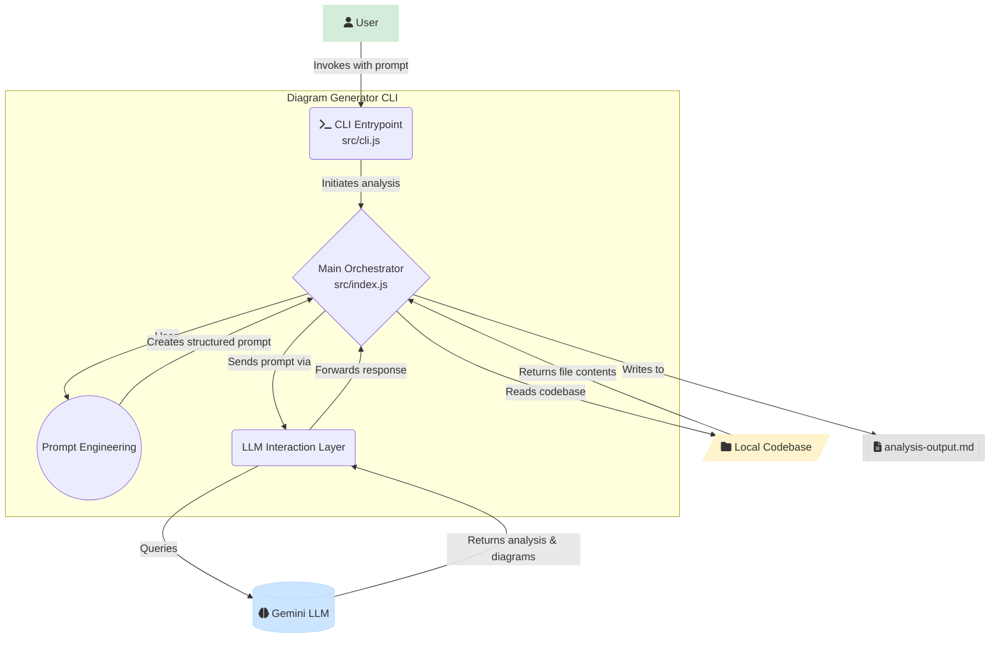
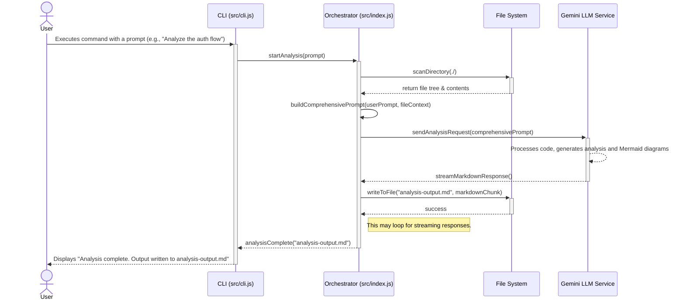

# System Architecture & Data Flow: Diagram Generator CLI

This document provides a detailed architectural overview of the Diagram Generator CLI, a Node.js application designed to analyze codebases and generate Mermaid diagrams using a Large Language Model (LLM).

The system is architected as a sophisticated wrapper around the Gemini CLI, orchestrating a multi-step pipeline involving prompt engineering, AI-driven analysis, validation, and iterative refinement.

## 1. Component Legend

The following color and shape scheme is used in the diagrams to represent different types of components within the system:

## 2. High-Level System Architecture

The application operates as a command-line tool that takes a user's request, analyzes a local codebase, interacts with an LLM to generate architectural documentation, and saves the result as a markdown file.

## 3. Core Components & Responsibilities

### 3.1. CLI Entrypoint (`src/cli.js`)
- **Responsibility:** Serves as the primary interface for the user.
- **Functionality:**
    - Parses command-line arguments and flags.
    - Handles user input, such as the initial analysis prompt.
    - Invokes the `Main Orchestrator` to start the generation process.
    - Displays status updates, progress indicators, and final output location to the user.

### 3.2. Main Orchestrator (`src/index.js`)
- **Responsibility:** The core of the application, managing the entire workflow from start to finish.
- **Functionality:**
    - Receives the initial request from the `CLI Entrypoint`.
    - Scans the target directory to gather context on the codebase structure and files.
    - Manages the state of the analysis, including intermediate steps and refinement loops.
    - Coordinates between the `Prompt Engineering` module, `LLM Interaction` layer, and the file system.
    - Handles the final output generation, writing the markdown received from the LLM to a file.

### 3.3. Prompt Engineering
- **Responsibility:** Constructs the detailed, context-rich prompts required by the LLM for accurate analysis.
- **Functionality:**
    - Gathers codebase context (file listings, key file contents).
    - Integrates the user's specific request.
    - Formats the information into a structured prompt that instructs the LLM to generate a markdown document with embedded Mermaid diagrams.

### 3.4. LLM Interaction Layer
- **Responsibility:** Manages all communication with the external Gemini LLM service.
- **Functionality:**
    - Wraps the Gemini CLI or API.
    - Sends the structured prompt to the LLM.
    - Handles responses, including streaming output and error management.
    - Validates or sanitizes the LLM output before passing it back to the `Main Orchestrator`.

## 4. Detailed Process & Data Flow

The following sequence diagram illustrates the step-by-step interaction between the components during a typical execution.

This entire process enables a powerful, automated workflow for generating high-quality architectural documentation directly from a project's source code, driven by the analytical capabilities of a large language model.