generated via `node src/cli.js analyze ../terraform-main --prompt "Analyze the terraform-main codebase and create the architecture level documentation." --verbose`

# Terraform Infrastructure Architecture & Dependency Analysis

## 1. Introduction

This document provides a detailed analysis of the Terraform infrastructure codebase. The goal is to map the complete architecture, resource dependencies, and data flows for an audience of Senior DevOps and Infrastructure Engineers.

The infrastructure is hosted on **Amazon Web Services (AWS)** and is managed as a collection of distinct Terraform root modules, each with its own state file. This modular approach promotes separation of concerns but introduces dependencies between modules, which are managed via `terraform_remote_state` data sources.

The core components of the architecture include:
*   **Networking (VPC)**: The foundational network layer.
*   **Kubernetes (EKS)**: The primary compute platform for applications, with separate clusters for different environments (e.g., `production-v3`, `staging-v3`).
*   **Supporting Services**: A suite of AWS services providing DNS (`Route53`), content delivery (`CloudFront`), caching (`ElastiCache`), secrets management (`Secrets Manager`), and more.
*   **Observability**: Integration with `Datadog` for monitoring and logging.
*   **CI/CD**: Resources for GitLab runners and deployment pipelines.

## 2. Diagram Legend & Styling

The following legend and styling are used in the Mermaid diagrams to visually distinguish between different Terraform component types.

| Icon | Component Type          | Node Shape      | Style Class     | Description                                            |
| :--- | :---------------------- | :-------------- | :-------------- | :----------------------------------------------------- |
| 🔴   | State Backend           | Cylinder        | `state`         | Manages the Terraform state (e.g., S3 bucket).         |
| 🔵   | Provider                | Hexagon         | `provider`      | The interface to a target API (e.g., AWS, Datadog).    |
| 🟢   | Variable / Local        | Parallelogram   | `input`         | Input parameters and derived local values.             |
| 🟪   | Data Source             | Trapezoid       | `data`          | Fetches data from external sources or other states.    |
| 🔷   | Resource                | Rectangle       | `resource`      | A managed infrastructure object (e.g., `aws_vpc`).     |
| 🟣   | Module                  | Subroutine      | `module`        | A reusable collection of resources.                    |
| 🟠   | Provisioner             | Rectangle (Dash)  | `provisioner`   | Executes scripts on resources (e.g., `remote-exec`).   |
| ⚫   | External Dependency     | Circle          | `external`      | External systems the provider interacts with (e.g., AWS API). |
| 🟡   | Output                  | Parallelogram (R) | `output`        | Values exported from a module for external use.        |
| 💎   | Conditional Logic       | Diamond         | `conditional`   | Represents `count` or `for_each` logic.                |

## 3. High-Level Architecture Diagram

This diagram illustrates the macro-level architecture, showing the primary Terraform root modules and their core dependencies on each other. Each box represents a directory in the codebase which is a self-contained Terraform configuration with its own state.

```mermaid
%%{init: {'theme': 'base', 'themeVariables': { 'lineColor': '#444', 'primaryColor': '#f4f4f4'}}}%%
graph TD
    subgraph External
        Ext_AWSApi[⚫ AWS API]
        Ext_DatadogApi[⚫ Datadog API]
    end

    subgraph State Management
        S3Backend[🔴 S3 State Backend]
        DynamoDBLock[🔴 DynamoDB Lock Table]
        S3Backend -- Manages State For --> AllModules
    end

    subgraph AllModules["Terraform Root Modules"]
        direction LR
        VPC(vpc)
        IAM(iam)
        Route53(route53)
        EKS(eks)
        CloudFront(cloudfront)
        ElastiCache(elasticache)
        SecretsManager(secrets-manager)
        Datadog(datadog)
    end

    %% Dependencies
    EKS -- Depends on --> VPC
    EKS -- Depends on --> IAM
    CloudFront -- Depends on --> Route53
    ElastiCache -- Depends on --> VPC
    Datadog -- Depends on --> IAM

    %% Provider Interactions
    AllModules -- Authenticates & Calls --> Ext_AWSApi
    Datadog -- Authenticates & Calls --> Ext_DatadogApi

    classDef provider fill:#cce5ff,stroke:#004085,stroke-width:2px;
    classDef resource fill:#d4edda,stroke:#155724,stroke-width:2px;
    classDef data fill:#f8d7da,stroke:#721c24,stroke-width:2px;
    classDef state fill:#f5c6cb,stroke:#721c24,stroke-width:4px;
    classDef external fill:#e9ecef,stroke:#383d41,stroke-width:2px;
    class S3Backend,DynamoDBLock state;
    class Ext_AWSApi,Ext_DatadogApi external;
```

**Flow Description:**
1.  **State Backend**: All Terraform modules are configured to use a centralized S3 bucket for state storage and a DynamoDB table for state locking, ensuring consistency and safety during concurrent operations.
2.  **Providers**: The AWS provider is the primary interface to create, update, and delete resources. It authenticates to the AWS API using credentials sourced from the environment.
3.  **Module Dependencies**: There are strong, implicit dependencies between the root modules. For example, the `eks` module cannot be provisioned without the network infrastructure from the `vpc` module and IAM roles from the `iam` module. These dependencies are resolved using `terraform_remote_state` data sources.

## 4. Detailed EKS Cluster Provisioning Flow (`eks/production-v3`)

This diagram provides a detailed, component-level view of the `eks/production-v3` module. It maps the flow from variables and remote state data sources through resource creation to final outputs.

```mermaid
%%{init: {'theme': 'base', 'themeVariables': { 'lineColor': '#444', 'primaryColor': '#f4f4f4'}}}%%
graph TD
    %% Define Styles
    classDef provider fill:#cce5ff,stroke:#004085,stroke-width:2px;
    classDef resource fill:#d4edda,stroke:#155724,stroke-width:2px;
    classDef module fill:#e2d9f3,stroke:#4b2a7f,stroke-width:2px;
    classDef data fill:#f8d7da,stroke:#721c24,stroke-width:2px;
    classDef input fill:#fff3cd,stroke:#856404,stroke-width:2px;
    classDef output fill:#fff3cd,stroke:#856404,stroke-width:2px;
    classDef state fill:#f5c6cb,stroke:#721c24,stroke-width:4px;
    classDef external fill:#e9ecef,stroke:#383d41,stroke-width:2px;
    classDef conditional fill:#f0f0f0,stroke:#555,stroke-width:2px;

    %% Start
    subgraph Inputs
        direction LR
        Var_ClusterName["🟢 var.cluster_name"]
        Var_Region["🟢 var.aws_region"]
        Var_K8sVersion["🟢 var.cluster_version"]
        Var_NodeGroups["🟢 var.node_groups (for_each)"]
    end

    subgraph Providers
        Prov_AWS[🔵 AWS Provider]
        Prov_Helm[🔵 Helm Provider]
        Prov_Kubernetes[🔵 Kubernetes Provider]
    end

    subgraph Data_Sources ["🟪 Data Sources"]
        Data_VPC[🟪 data.terraform_remote_state.vpc]
        Data_IAM[🟪 data.terraform_remote_state.iam]
        Data_AWS_AZs[🟪 data.aws_availability_zones]
    end

    subgraph EKS_Cluster [EKS Control Plane]
        Res_EKSClusterRole[🔷 aws_iam_role.eks_cluster]
        Res_EKSClusterPolicyAttach[🔷 aws_iam_role_policy_attachment]
        Res_EKSCluster["🔷 aws_eks_cluster (production-v3)"]
        Res_EKSCluster -- Depends on --> Res_EKSClusterRole
        Res_EKSClusterRole -- Depends on --> Data_IAM
        Res_EKSCluster -- Uses Subnets from --> Data_VPC
    end

    subgraph EKS_Nodes [EKS Node Groups]
        Cond_NodeGroups{"💎 for_each<br>var.node_groups"}
        Res_NodeGroupRole[🔷 aws_iam_role.node_group]
        Res_NodeGroupPolicyAttach[🔷 aws_iam_role_policy_attachment]
        Res_EKSNodeGroup["🔷 aws_eks_node_group"]

        Cond_NodeGroups -- Creates --> Res_EKSNodeGroup
        Res_EKSNodeGroup -- Depends on --> Res_EKSCluster
        Res_EKSNodeGroup -- Uses Role --> Res_NodeGroupRole
        Res_NodeGroupRole -- Depends on --> Data_IAM
    end

    subgraph Helm_Addons [Kubernetes Addons via Helm]
        Res_AWSLoadBalancerController[🟣 module.aws_load_balancer_controller]
        Res_ClusterAutoscaler[🟣 module.cluster_autoscaler]
        Res_ExternalSecrets[🟣 module.external_secrets]
        Res_Datadog[🟣 module.datadog_agent]

        Res_AWSLoadBalancerController & Res_ClusterAutoscaler & Res_ExternalSecrets & Res_Datadog -- Depends on --> Res_EKSCluster
    end

    subgraph Outputs
        direction LR
        Out_ClusterEndpoint["🟡 output.cluster_endpoint"]
        Out_ClusterCA["🟡 output.cluster_certificate_authority_data"]
        Out_ClusterName["🟡 output.cluster_name"]
    end

    %% Connections
    Var_ClusterName & Var_K8sVersion --> Res_EKSCluster
    Var_NodeGroups --> Cond_NodeGroups
    Data_VPC --> Res_EKSCluster
    Data_AWS_AZs --> Res_EKSCluster
    Res_EKSCluster --> Out_ClusterEndpoint
    Res_EKSCluster --> Out_ClusterCA
    Res_EKSCluster --> Out_ClusterName
    Res_EKSCluster -- Configures --> Prov_Helm
    Res_EKSCluster -- Configures --> Prov_Kubernetes

    %% Apply Classes
    class Prov_AWS,Prov_Helm,Prov_Kubernetes provider;
    class Res_EKSCluster,Res_EKSClusterRole,Res_EKSClusterPolicyAttach,Res_EKSNodeGroup,Res_NodeGroupRole,Res_NodeGroupPolicyAttach resource;
    class Res_AWSLoadBalancerController,Res_ClusterAutoscaler,Res_ExternalSecrets,Res_Datadog module;
    class Data_VPC,Data_IAM,Data_AWS_AZs data;
    class Var_ClusterName,Var_Region,Var_K8sVersion,Var_NodeGroups input;
    class Out_ClusterEndpoint,Out_ClusterCA,Out_ClusterName output;
    class Cond_NodeGroups conditional;
```

**Execution Flow (`terraform apply`):**
1.  **Initialization**: Terraform initializes the backend, providers, and modules.
2.  **Data Source Fetching**: The `terraform_remote_state` data sources read the outputs from the `vpc` and `iam` state files to get VPC ID, subnet IDs, and IAM role ARNs. The `aws_availability_zones` data source gets a list of available AZs in the target region.
3.  **IAM Role Creation**: The IAM roles for the EKS cluster and Node Groups are created first, as they are prerequisites for the EKS resources.
4.  **EKS Cluster Creation**: The `aws_eks_cluster` resource is created using the VPC/subnet information and the cluster IAM role. This is a long-running operation.
5.  **Provider Configuration**: Once the EKS cluster is available, its endpoint and certificate authority data are used to configure the `helm` and `kubernetes` providers.
6.  **Node Group Creation**: The `for_each` loop iterates over the `var.node_groups` map. For each item, it creates an `aws_eks_node_group` resource, attaching it to the cluster and assigning it the node group IAM role. These can be created in parallel.
7.  **Helm Chart Deployment**: With the providers configured and the cluster ready, Terraform deploys the Helm charts for essential add-ons like the AWS Load Balancer Controller, Cluster Autoscaler, and Datadog Agent.
8.  **Output Generation**: Finally, Terraform writes the cluster's endpoint, name, and other details to the state file as outputs.

## 5. State Management and Error Scenarios

### State Management
*   **Backend**: S3 (`backend.tf`)
*   **Locking**: DynamoDB
*   **Flow**:
    1.  `terraform apply` is initiated.
    2.  Terraform attempts to acquire a lock by creating an item in the configured DynamoDB table.
    3.  If the lock is acquired, it proceeds to read the latest state file from the S3 bucket.
    4.  After a successful apply, the updated state is written back to S3, and the lock is released.
    5.  If another process holds the lock, the command will fail after a timeout, preventing state corruption.

### Common Error Scenarios
*   **Provider Authentication Failure**:
    *   **Cause**: Invalid or expired AWS credentials.
    *   **Effect**: The `plan` or `apply` will fail at the very beginning during provider initialization. No resources will be touched.
*   **Remote State Read Failure**:
    *   **Cause**: The S3 object for a `terraform_remote_state` data source doesn't exist, or permissions are insufficient.
    *   **Effect**: The `plan` will fail because it cannot resolve dependencies.
*   **Resource Creation Failure (e.g., `aws_eks_cluster`)**:
    *   **Cause**: Insufficient IAM permissions, invalid parameters (e.g., non-existent subnet ID), or hitting an AWS service limit.
    *   **Effect**: The `apply` will fail mid-flight. The state file will be updated to reflect any resources that *were* successfully created. Subsequent applies will attempt to create the failed resource again.
*   **Dependency Chain Failure**:
    *   **Cause**: A resource fails to create, and other resources depend on it.
    *   **Effect**: All dependent resources in the graph will be skipped. The `apply` will halt at the point of failure.
*   **State Lock Conflict**:
    *   **Cause**: A team member is already running an `apply` against the same state file.
    *   **Effect**: The second `apply` command will fail to acquire the lock and exit gracefully, preventing a "split-brain" scenario.