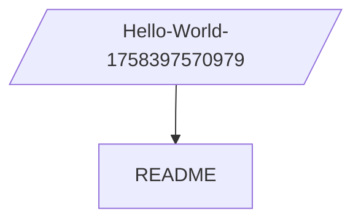

I'll analyze the repository and create a flowchart. First, I'll list the files to understand the project structure.README is the only file. I'll read it to understand the project.This is a "Hello World!" project with no code, so the flowchart is just the project root containing the README. Is this what you want, or should I format it differently? If you want a diagram file, tell me the name and format.Oops, wrong tool. I should have just shown the mermaid diagram. Here it is:

